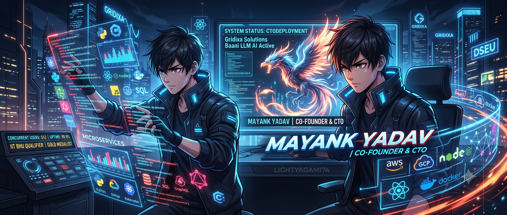

# Hi 👋, I'm Mayank Yadav

<p align="center">
  
</p>

<h1 align="center">🚀 Software Engineer | AI Developer | Full Stack Developer</h1>

<p align="center">

</p>

<p align="center">
<a href="https://github.com/LIGHTYAGAMI74"></a>

</p>

---

# 💫 About Me

```yaml
Name: Mayank Yadav
Role: Software Engineer
Company: Co-Founder & CTO @ Gridixa Solutions
Education: B.Tech Network Engineering & Security
Interests:
  - AI
  - LLM Applications
  - Backend Engineering
  - Cloud
  - System Design
```

- 🔭 Building AI products
- 🌱 Learning Distributed Systems
- ☁️ AWS • GCP • Docker
- 🧠 Solved 148+ LeetCode Problems
- ⚡ Love Full Stack Development

---

# 🛠 Tech Stack

<p align="center">

</p>

---

# 📊 GitHub Analytics

<p align="center">


</p>

---

# 🔥 GitHub Streak

<p align="center">

</p>

> Current Streak: **13 Days** *(update manually if needed)*

---

# 📈 Contribution Graph

<p align="center">

</p>

---

# 💻 Featured Projects

| Project | Description |
|----------|-------------|
| 🤖 AI Olympiad | AI competition platform |
| 🌍 Disaster Shield | Disaster management platform |
| 🛒 E-Commerce Platform | Production-ready store |

---

# 🧠 LeetCode


- ✅ Problems Solved: **36+**
- 🎯 Goal: 500+


---

# 🚀 Experience

- 🚀 Co-Founder & CTO — Gridixa Solutions
- 💻 Software Developer — The Green Mind NGO
- ⚙️ Backend Developer Intern — Planning Center

---

# 🏅 Achievements

- 🥇 National Hackathon Qualifier (IIT BHU)
- 🥇 Three-time Gold Medalist (Mathematics & Science Olympiads)
- ☁️ Built scalable AI systems
- 👨‍💻 Full Stack Engineer

---

# 🌐 Connect

- GitHub: https://github.com/LIGHTYAGAMI74
- LinkedIn: https://linkedin.com/in/mayank247

---

# 💬 Dev Quote

> "First, solve the problem. Then, write the code."

---

# 🌊 Footer

<p align="center">

</p>
